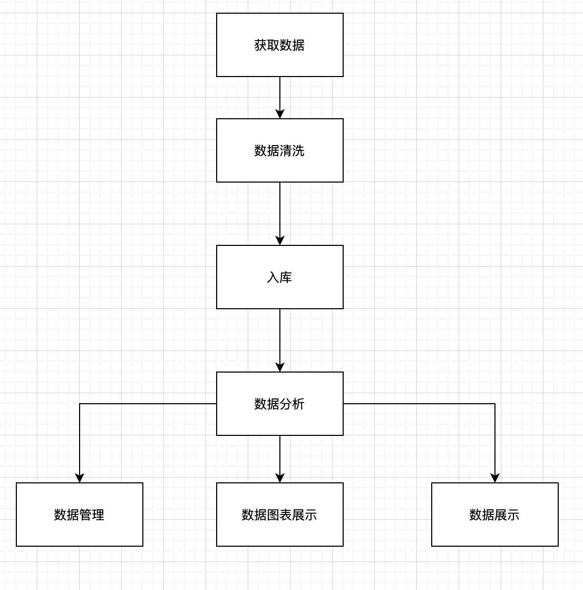

# JDProject

#### 介绍
京东球鞋爬虫，并进行分析和展示

#### 软件架构
软件架构说明
 

#### 安装教程

1. 安装依赖
pip install -r requirements.txt

#### 使用说明
1.分别运行数据爬虫入库教程
- 首先运行JDScript/spider.py 里面设置爬取内容和数量
- 运行JDScript/cleaning_data.py 进行数据清洗
- 运行JDScript/import_data.py 数据入库

2.或者一起运行
- 运行JDScript/run.py

3.启动服务
- python manage.py runserver
